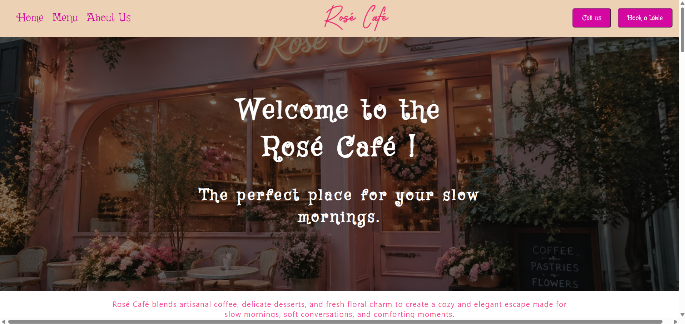
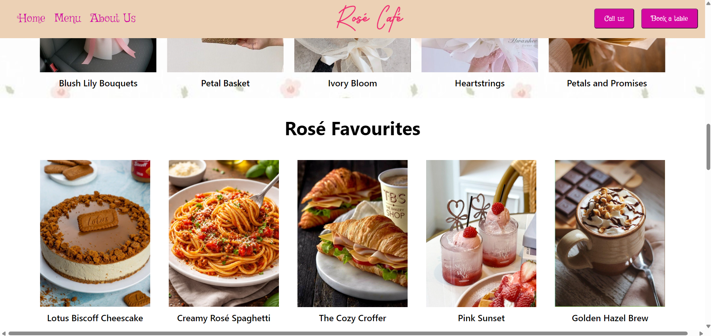
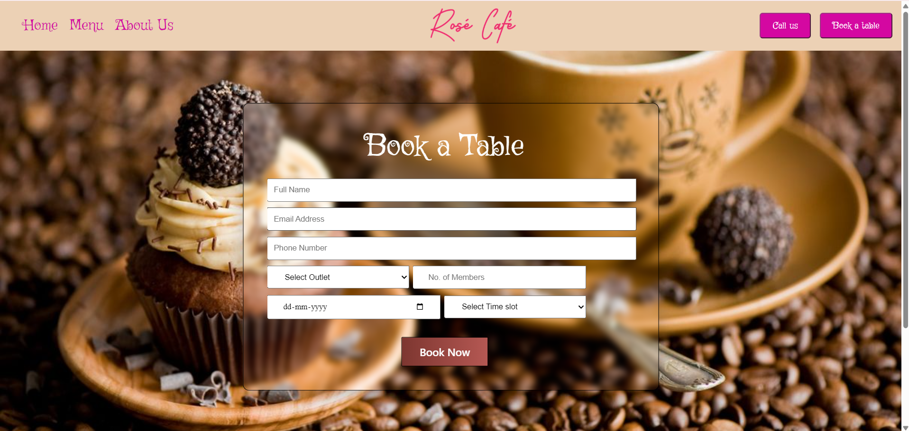

# Restaurant Website

## Overview

A responsive multi-page restaurant website built using HTML and CSS. The project includes essential restaurant features such as navigation, table reservation, contact page, customer reviews, and gallery sections.

## Features

- Responsive design
- Multi-page website
- Navigation bar
- Table booking form
- About Us page
- Contact Us page
- Customer reviews section
- Gallery section
- Modern UI design

## Tech Stack

- HTML5
- CSS3

## Project Type

Frontend Web Development Project

## SCREENSHOTS
### Landing Page

### Image Gallery

### Table Reservation

## Author

Jhanvi Gupta
